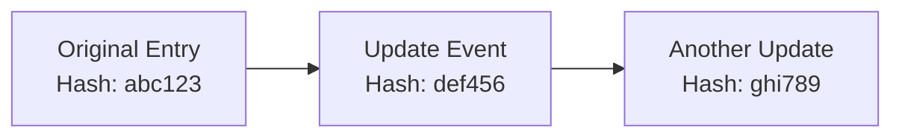

<!-- _class: lead -->
<!-- _paginate: false -->

# PRISM VDR Driver
## Introduction & Code Examples

**Verifiable Data Registry on Cardano Blockchain**

[This VDR is part of Hyperledger Identus Project and was created under the Cardano's Project Catalyst #1300189, Milestone 3 https://milestones.projectcatalyst.io/projects/1300189/milestones/3](https://milestones.projectcatalyst.io/projects/1300189/milestones/3)


---

## What is a Verifiable Data Registry (VDR)?

A **Verifiable Data Registry** is a system that:

- **Stores data** that can be independently verified
- **Creates an immutable audit trail** of all changes
- **Provides cryptographic proof** of data authenticity
- **Enables decentralized trust** without central authority

**Real-world analogy:** Think of it like a public notary service that timestamps and validates documents, but it's automated, decentralized, and permanent.

---

## Why Blockchain for VDR?

Blockchain provides:

✅ **Immutability** - Data cannot be changed once written
✅ **Transparency** - Anyone can verify the data
✅ **Decentralization** - No single point of failure
✅ **Cryptographic Security** - Strong mathematical guarantees
✅ **Timestamp Proof** - When data was created/modified

**This project uses Cardano blockchain** - a proof-of-stake blockchain with high security and low energy consumption.

---

## What is the PRISM VDR Protocol?

The **PRISM VDR Protocol** is the part of the PRISM Protocol specification that defines:

1. **How to structure data** for storage on Cardano
2. **How to sign data** with cryptographic keys
3. **How to create, update, and delete entries** on-chain
4. **How to verify data authenticity** from the blockchain

**Key Features:**
- Uses Cardano transaction metadata [(label `21325`)](https://github.com/cardano-foundation/CIPs/pull/973)
- Encodes data in Protocol Buffers (protobuf)
- Signs with secp256k1 ECDSA cryptography
- Supports both identity (SSI) and generic storage entries

---

## PRISM Protocol - Entry Types


**SSI (Self-Sovereign Identity) Entries**
- Represent [`did:prism` identifiers (DIDs)](https://github.com/input-output-hk/prism-did-method-spec) & DID Documents
- Contain cryptographic keys (MASTER_KEY, VDR_KEY, etc.)
- Form a chain of lifecycle events (E-1, E-2, E-6)
- **SSI identifier** = hash of the creation event (E-1)

**Storage Entries**
- Store arbitrary data (up to 16KB per transaction metadata limit)
- **Owned by** an SSI entry (signed by owner's VDR_KEY)
- Form a chain of lifecycle events (E-7, E-8, E-9)
- Support multiple data types: byte arrays, IPFS CIDs, etc and custom types.
- Auto-deactivate when owner SSI is deactivated

---

## PRISM Protocol - Event Flow

**How data gets recorded on Cardano:**

1. **Create Event** - Construct PRISM event
2. **Sign with Private Key** - Sign with appropriate key purpose
3. **Encode as Protobuf** - Serialize event using Protocol Buffers
4. **Submit to Cardano** - Send transaction via Blockfrost API
5. **Transaction Confirmed** - Included in blockchain (~2-3 blocks, a few minutes)
6. **Data Immutable** - Considered immutable after confirmation

**Settlement Time:**
- **Practically immutable:** After a few blocks (~5-10 minutes)
- **Fully settled:** ~36 minutes (guaranteed immutability)

---

## What is the PRISM VDR Driver?

The **PRISM VDR Driver** is a **Scala 3 implementation** that:

- ✅ **Implements the PRISM VDR Protocol**
- ✅ **Provides a simple Java-compatible API**
- ✅ **Handles blockchain interaction** via Blockfrost API
- ✅ **Manages cryptographic signing** automatically
- ✅ **Published to Maven Central** for easy integration

**Think of it as:** A library that makes it easy to use the PRISM VDR Protocol without dealing with blockchain complexity.

<!--
---

## Driver Architecture

<div class="mermaid">
graph LR;
    A[Your Application] --> B[Generic VDR Driver API];
    B --> C[PRISM VDR Driver];
    C --> D[ZIO Effect System];
    D --> E[Blockfrost API];
    E --> F[Cardano Blockchain];
</div>

**Key Components:**
- **PRISMDriver** - Main API implementation
- **GenericVDRDriver** - Core VDR logic (from scala-did library)
- **ZIO** - Functional effect system for async operations
- **Blockfrost** - API gateway to Cardano blockchain
-->

---

## Core CRUD Operations

The driver provides 5 main operations:

| Operation  | Description |
|------------|-------------|
| `create()` | Create new storage entry on blockchain |
| `read()`   | Fetch data from blockchain by identifier |
| `update()` | Update existing entry with new data |
| `delete()` | Deactivate entry (marks as deleted) |
| `verify()` | Verify data and get cryptographic proof |

Let's see each one in action with code examples!

---

## Setup - Configuration

Before using the driver, you need to configure it:

```scala
import hyperledger.identus.vdr.prism.*
import fmgp.did.method.prism.*
import fmgp.did.method.prism.cardano.*
import fmgp.crypto.Secp256k1PrivateKey

// 1. Configure Blockfrost API access (preprod testnet)
val blockfrostConfig = BlockfrostConfig(token = "preprod_TOKEN...")
// 2. Configure wallet with 24-word mnemonic
// ⚠️ WARNING: This is a test wallet for demo purposes only!
val walletConfig = CardanoWalletConfig(Seq(
  "mention", "side", "album", "physical", "uncle", "lab",
  "horn", "nasty", "script", "few", "hazard", "announce",
  "upon", "group", "ten", "moment", "fantasy", "helmet",
  "supreme", "early", "gadget", "curve", "lecture", "edge"
))
// 3. Your DID identifier that owns the VDR entries
val didPrism = DIDPrism("51d47b13393a7cc5c1afc47099dcbecccf0c8a70828c072ac82f55225b42d4f4")
// 4. Derive VDR signing key from wallet (key purpose: 0, 1)
val vdrKey = Secp256k1PrivateKey(walletConfig.secp256k1PrivateKey(0, 1).rawBytes)
```

---

## Setup - Create Driver Instance

```scala
// Initialize the PRISM Driver with MongoDB and automatic indexing
val driver = PRISMDriverMongoDBWithIndexer(
   blockfrostConfig = blockfrostConfig,    // Blockfrost config
   wallet = walletConfig,                  // Cardano wallet
   didPrism = didPrism,                    // Your DID
   vdrKey = vdrKey,                        // Signing VDR key
   mongoDBConnection = mongoDBConnection.  // connection to BD
 )

// Driver is ready to use!
println(s"✓ Driver Version: ${driver.getVersion}")   // Output: 1.0
println(s"✓ Driver Family: ${driver.getFamily}")     // Output: PRISM
println(s"✓ Driver ID: ${driver.getIdentifier}")     // Output: PRISMDriverMongoDBWithIndexer
```

**Note:** This driver variant uses MongoDB for persistence and runs automatic indexing before each operation.

---

## CREATE - Store Data on Blockchain

```scala
val originalData = "My Data. Just some bytes".getBytes
val createResult = driver.create(originalData, Map.empty.asJava)
val vdrEntryId = createResult.getIdentifier

println(s"Data created: ${bytes2Hex(originalData)}")
println(s"VDREntryID: $vdrEntryId")
println(s"State: ${createResult.getState}")  // SUCCESS
```

**What happens:**
1. Data is encoded in protobuf
2. Signed with your VDR key
3. Submitted to Cardano blockchain
4. Returns unique identifier ('create' event hash)

---

## CREATE - Real Example

You can run this example from the demo:

```bash
sbt demo/run step1
```

**Output:**
```
Data created: 4d792044617461...
VDREntryID: abc123def456...
State: SUCCESS
```

**The data is now permanently stored on Cardano blockchain and verifiable!**

---

## READ - Retrieve Data from Blockchain

```scala
val readData = driver.read(
  Array(vdrEntryId),      // Identifier from create operation
  Map.empty.asJava,       // Optional queries
  null,                   // Fragment (not used)
  Array.empty             // Public keys (not required)
)
println(s"Data read: ${bytes2Hex(readData)}")
println(s"Data length: ${readData.length} bytes")
```

**Run the demo:**
```bash
sbt demo/run step2  # Reads data created in step1
```

**What happens:**
1. Driver queries Cardano blockchain via Blockfrost
2. Fetches transaction with matching event hash
3. Decodes protobuf data
4. Returns original byte array

---

## UPDATE - Modify Existing Entry

```scala
val updatedData = "Updated Data".getBytes
val updateResult = driver.update(
  updatedData,             // New data
  Array(vdrEntryId),       // Path: identifier of entry to update
  Map.empty.asJava,        // Queries (optional)
  null,                    // Fragment (not used)
  Map.empty.asJava         // Options (optional)
)
val newId = updateResult.getIdentifier

println(s"New data: ${bytes2Hex(updatedData)}")
println(s"VDR Entry Id  : $vdrEntryId")
println(s"New identifier: $newId")
println(s"State: ${updateResult.getState}")  // SUCCESS
```

**Run the demo:**
```bash
sbt demo/run step3  # Updates the entry from step1
```

**Important:** Updates create a chain of events. Original data remains accessible.

---

## UPDATE - How it Works



Each update:
- Creates a **new event** on the blockchain
- References the **previous event hash**
- Forms an **immutable chain** of updates
- Both old and new data remain on-chain

**To get latest data:** Use the most recent identifier

---

## DELETE - Deactivate Entry

```scala
driver.delete(
  Array(vdrEntryId),       // Path: identifier to delete
  Map.empty.asJava,        // Queries (optional)
  null,                    // Fragment (not used)
  Map.empty.asJava         // Options (optional)
)
println("✓ Entry deactivated")
```

**Run the demo:**
```bash
sbt demo/run step6  # Deactivates the entry
sbt demo/run step7  # Try to read - returns empty (step7 = step2)
```

**Try to read after deactivation:**
```scala
val deletedData = driver.read(Array(vdrEntryId), Map.empty.asJava, null, Array.empty)
println(s"Data length: ${deletedData.length}")  // Output: 0
```

**Note:** "Delete" in blockchain terms means marking as deactivated. The data is still on-chain but marked as inactive.

---

## VERIFY - Get Cryptographic Proof

```scala
val proof = driver.verify(
  Array(vdrEntryId),       // Path: identifier to verify
  Map.empty.asJava,        // Queries (optional)
  null,                    // Fragment (not used)
  Array.empty,             // Public keys (optional)
  true                     // returnData: Include data in response
)

println(s"Proof Type: ${proof.getType}")              // "PrismBlock"
println(s"Data: ${bytes2Hex(proof.getData)}")         // Original data
println(s"Proof bytes: ${proof.getProof.length}")     // Cryptographic proof
println("✓ Cryptographic proof obtained")
```

**Run the demo:**
```bash
sbt demo/run step5  # Verify and get cryptographic proof
```

**Use cases:**
- Prove data existed at a specific time
- Verify data hasn't been tampered with
- Show audit trail of changes

---

## Check Operation Status

```scala
val status = driver.storeResultState(vdrEntryId)

status match {
  case Driver.OperationState.SUCCESS =>
    println("✅ Operation succeeded")
  case Driver.OperationState.RUNNING =>
    println("⏳ Operation in progress")
  case Driver.OperationState.ERROR =>
    println("❌ Operation failed")
}
```

**Run the demo:**
```bash
sbt demo/run step8  # Check operation status
```

**Note:** Currently the driver runs synchronously, so operations return immediately with SUCCESS or throw exceptions on error.

**Future enhancement:** Async operations could return RUNNING state for long transactions.

---

## Complete Example - End to End

**The complete workflow is available in the demo as step-by-step examples:**

```bash
# Run each step in sequence:
sbt demo/run step0  # Create DID (one-time setup)
sbt demo/run step1  # CREATE - Store data on blockchain
sbt demo/run step2  # READ - Retrieve the data
sbt demo/run step3  # UPDATE - Modify the entry
sbt demo/run step4  # READ - Read updated data (step4 = step2)
sbt demo/run step5  # VERIFY - Get cryptographic proof
sbt demo/run step6  # DELETE - Deactivate entry
sbt demo/run step7  # READ - Try to read (returns empty, step7 = step2)
sbt demo/run step8  # Check operation status
```

**Or see the full code in:**
- `demo/src/main/scala/demo/ExamplesStepByStep.scala`
- `demo/src/main/scala/demo/DemoConfig.scala`

**All examples use:**
```scala
val driver = DemoConfig.createDriverMongoDBWithIndexer()
// Combines MongoDB persistence + automatic blockchain indexing
```

---

## Use Cases

**Where would you use PRISM VDR Driver?**

1. **Digital Identity Systems**
   - Store and manage decentralized identifiers (DIDs)
   - Verifiable credentials and attestations
2. **Audit Trails**
   - Tamper-proof logging
   - Compliance and regulatory records
3. **Document Verification**
   - Notarization of documents
   - Timestamp proofs

---
## Use Cases
4. **Supply Chain**
   - Track product provenance
   - Verify authenticity
5. **Healthcare**
   - Medical record integrity
   - Consent management
6. **Whistleblower**
   - Censorship resistance
   - Confidentially and Anonymously (No PII is collected)
   - Data Integrity and Verifiability
   - **Proof of Continuity!**
---

## Integration - Maven/SBT

**Add to your project:**

- **SBT (build.sbt):**
  ```scala
  libraryDependencies += "org.hyperledger.identus" %% "prism-vdr-driver" % "0.3.0"
  ```

- **Maven (pom.xml):**
  ```xml
  <dependency>
      <groupId>org.hyperledger.identus</groupId>
      <artifactId>prism-vdr-driver_3</artifactId>
      <version>0.3.0</version>
  </dependency>
  ```

- **Gradle (build.gradle):**
  ```gradle
  implementation 'org.hyperledger.identus:prism-vdr-driver_3:0.3.0'
  ```

**Repository:** Published to Maven Central


---

## Requirements

**To use the PRISM VDR Driver you need:**

1. **Java 17+** runtime environment
2. **Blockfrost API token** (free tier is available)
   - Sign up at: https://blockfrost.io
   - Choose preprod (testing) or mainnet (production)
3. **Cardano wallet mnemonic** (24 words)
   - Generate with any Cardano wallet (Daedalus, Yoroi, Identus SDKs, etc.)
4. **DID identifier** and VDR key
   - Created during SSI initialization
5. **ADA tokens** (only for mainnet)
   - Transactions cost ~0.2 ADA
   - Preprod uses test tokens (free)

---

## Key Technical Details

**Protocol Specifications:**
- **Blockchain:** Cardano (mainnet or preprod)
- **Metadata Label:** `21325` (PRISM_LABEL)
- **Encoding:** Protocol Buffers (protobuf)
- **Signature Algorithm:** secp256k1 ECDSA with SHA-256
- **Max Entry Size:** 16,384 bytes (Cardano transaction limit)
- **Settlement Time:** ~36 minutes (guaranteed immutability)

**Driver Specifications:**
- **Language:** Scala 3.3.6
- **License:** Apache 2.0
- **API:** Java-compatible interface

---

## Networks - Preprod vs Mainnet

**Preprod (Testnet):**
- ✅ Free test TADA tokens
- ✅ Fast testing and iteration
- ✅ Same functionality as mainnet
- ⚠️ Data may be reset periodically
- 📍 Explorer: https://preprod.cardanoscan.io

**Mainnet (Production):**
- ✅ Permanent, production-grade storage
- ✅ Real economic value
- ⚠️ Costs real ADA (~0.2 per transaction)
- ⚠️ Data is PERMANENT (cannot be removed)
- 📍 Explorer: https://cardanoscan.io

---

## Security Considerations

**✅ Strong Security Features:**
- secp256k1 cryptographic signatures
- Blockchain immutability
- Public verifiability

**⚠️ Important Warnings:**

1. **Private Keys:** Never commit wallet mnemonics to git!
2. **Public Data:** All blockchain data is PUBLIC and permanent
3. **No Deletion:** "Delete" only marks as inactive, data remains on-chain
4. **Key Management:** Losing VDR's owers keys means losing control of the SSI and storage entries
5. **API Tokens:** Protect your Blockfrost API token

**Best Practice:** Use environment variables or secure vaults for sensitive configuration.

---

## Resources & Documentation

**Official Documentation:**
- 📖 PRISM VDR Specification: `prism-vdr-specification.md`
- 💻 Source code: https://github.com/hyperledger-identus/prism-vdr-driver

**Hyperledger Identus:**
- 🌐 Website: https://www.hyperledger.org/projects/identus
- 📚 Identus VDR Spec: https://github.com/hyperledger-identus/identus-vdr

**Cardano Resources:**
- 🔗 Blockfrost API: https://blockfrost.io
- 🔍 Block Explorer: https://cardanoscan.io


---

## Summary

**What we covered:**

✅ **PRISM VDR Protocol** - Specification for verifiable data on Cardano
✅ **PRISM VDR Driver** - Scala 3 implementation of the protocol
✅ **5 Core Operations** - Create, Read, Update, Delete, Verify
✅ **Code Examples** - How to use each operation
✅ **Configuration** - Setup and integration
✅ **Use Cases** - Real-world applications

**Key Takeaway:**
The PRISM VDR Driver makes it easy to store verifiable, immutable data on the Cardano blockchain with just a few lines of code.

---

## Thank You!

# Questions?

**Contact & Resources:**
- 📧 GitHub Issues: https://github.com/hyperledger-identus/prism-vdr-driver/issues
- 💬 Hyperledger Identus Community:
  - 💬 [Discord Identus channel - Linux Foundation Decentralized Trust](https://discord.gg/8dk4zW6D)
  - 🐛 [Identus Community weekly meeting](https://zoom-lfx.platform.linuxfoundation.org/meeting/91318829844?password=76de6c0a-d9aa-4494-a4f5-e4204c538a91)
- 📖 [Full documentation in repository](https://github.com/hyperledger-identus/prism-vdr-driver)

**License:** Apache 2.0

---

<!-- _class: lead -->
<!-- _paginate: false -->
<!-- footer: 'Hyperledger Identus | © 2025' -->


**Made with ❤️ by the Hyperledger Identus Team**

<!-- This presentation created with [Marp](https://marp.app/) -->
