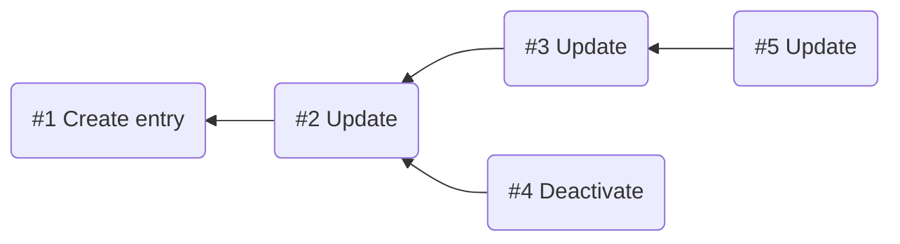

```mermaid
%% flowchart TD    
flowchart RL
  create(#1 Create entry)
  update1(#2 Update)
  update2(#3 Update)
  deactivate1(#4 Deactivate)
  update3(#5 Update)
  update1 --> create
  update2 --> update1
  update3 --> update2
  deactivate1 --> update1
```