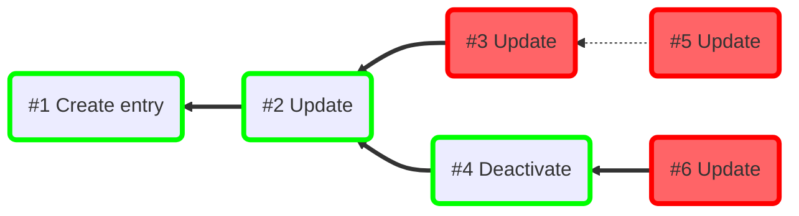

```mermaid
%% flowchart TD    
flowchart RL
  create(#1 Create entry):::ok
  update1(#2 Update):::ok
  update2(#3 Update):::fail
  deactivate1(#4 Deactivate):::ok
  update3(#5 Update):::fail
  update6(#6 Update):::fail
  update1 ==> create
  update2 ==> update1
  update3 -.-> update2
  deactivate1 ==> update1
  update6 ==> deactivate1

  classDef fail fill:#FF6467,stroke:#f00,stroke-width:4px
  classDef ok stroke:#0f0,stroke-width:4px
```
