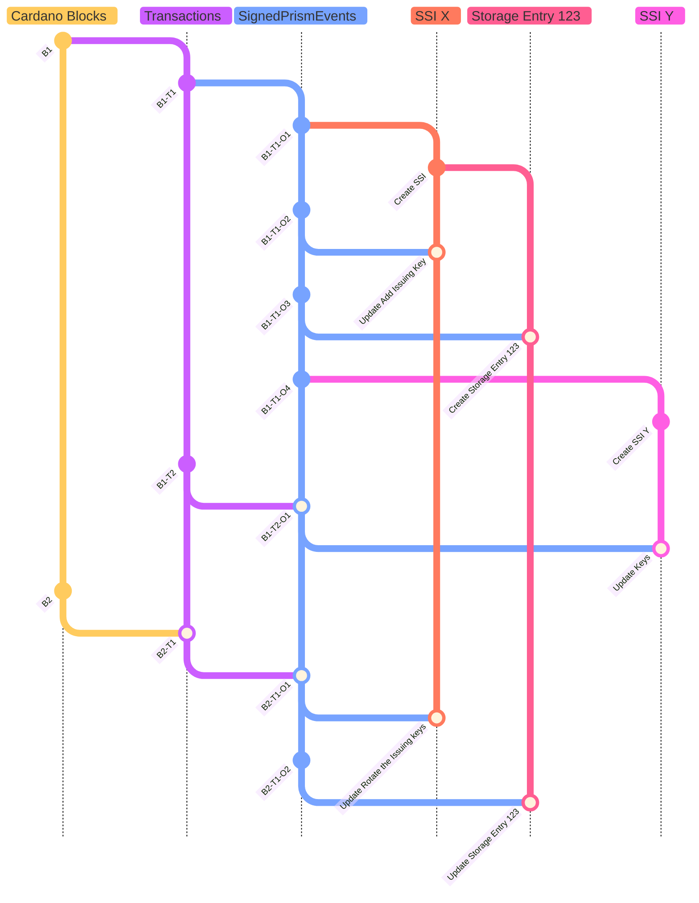

```mermaid
%%{init: { 'logLevel': 'debug', 'theme': 'base', 'gitGraph': {'showBranches': true, 'showCommitLabel':true,'mainBranchName': 'Cardano Blocks'}} }%%
gitGraph TB:
  commit id: "B1"

  branch "Transactions"
  checkout "Transactions"
  commit id: "B1-T1"

  branch "SignedPrismEvents"

  checkout "SignedPrismEvents"
  commit id: "B1-T1-O1"
  branch "SSI X"
  checkout "SSI X"

  commit id: "Create SSI"
  branch "Storage Entry 123"

  checkout SignedPrismEvents
  commit id: "B1-T1-O2"
  checkout "SSI X"
  merge "SignedPrismEvents" id:"Update Add Issuing Key"


  checkout "SignedPrismEvents"
  commit id: "B1-T1-O3"
  checkout "Storage Entry 123"
  merge "SignedPrismEvents" id: "Create Storage Entry 123"

  checkout "SignedPrismEvents"
  commit id: "B1-T1-O4"
  branch "SSI Y"
  checkout "SSI Y"
  commit id: "Create SSI Y"

  checkout "Transactions"
  commit id: "B1-T2"
  checkout "SignedPrismEvents"
  merge "Transactions" id:"B1-T2-O1"


  checkout "SSI Y"
  merge "SignedPrismEvents" id: "Update Keys"


  checkout "Cardano Blocks"
  commit id: "B2"

  checkout "Transactions"
  merge "Cardano Blocks" id: "B2-T1"
  
  checkout "SignedPrismEvents"
  merge "Transactions" id:"B2-T1-O1"

  checkout "SSI X"
  merge "SignedPrismEvents" id: "Update Rotate the Issuing keys"
 

  checkout "SignedPrismEvents"
  commit id: "B2-T1-O2"
  checkout "Storage Entry 123"
  merge "SignedPrismEvents" id: "Update Storage Entry 123"
```

