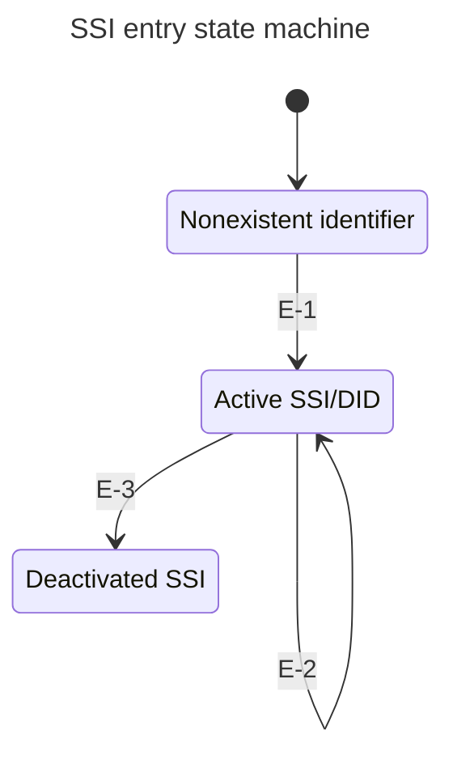
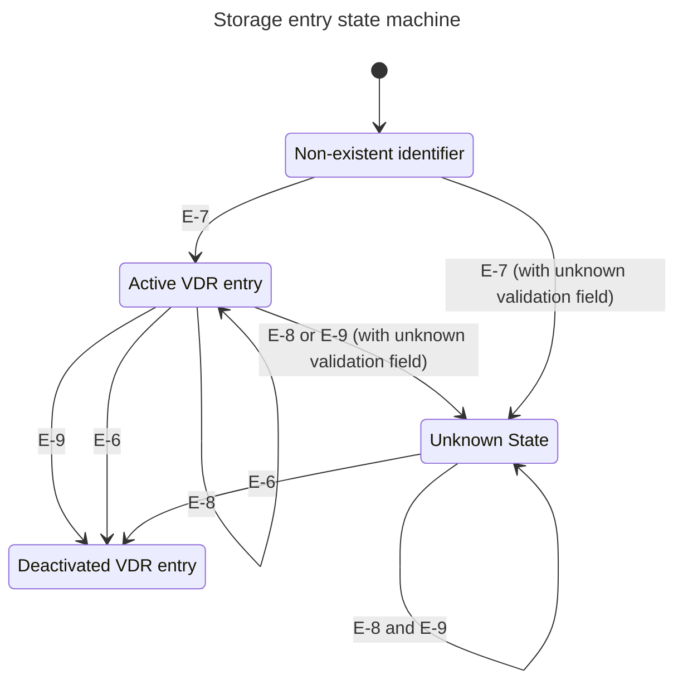
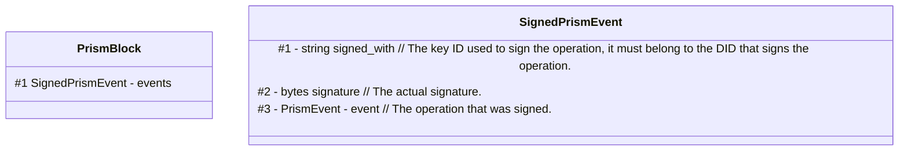
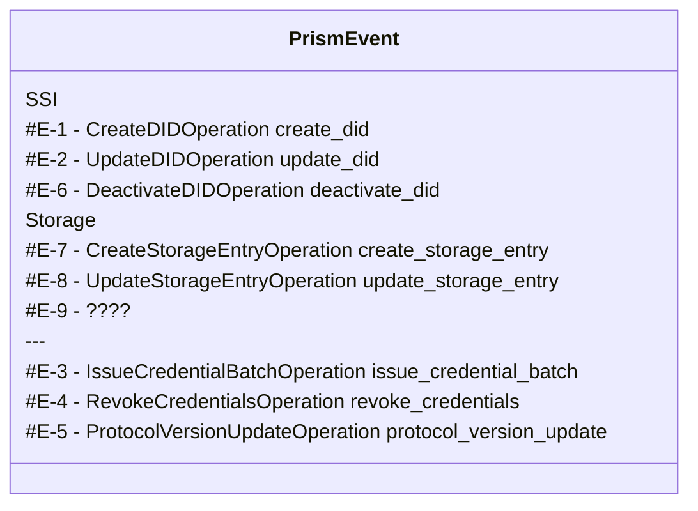
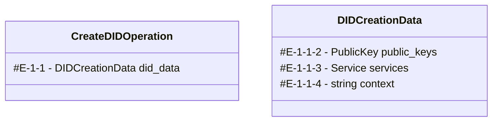
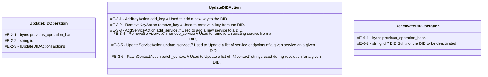
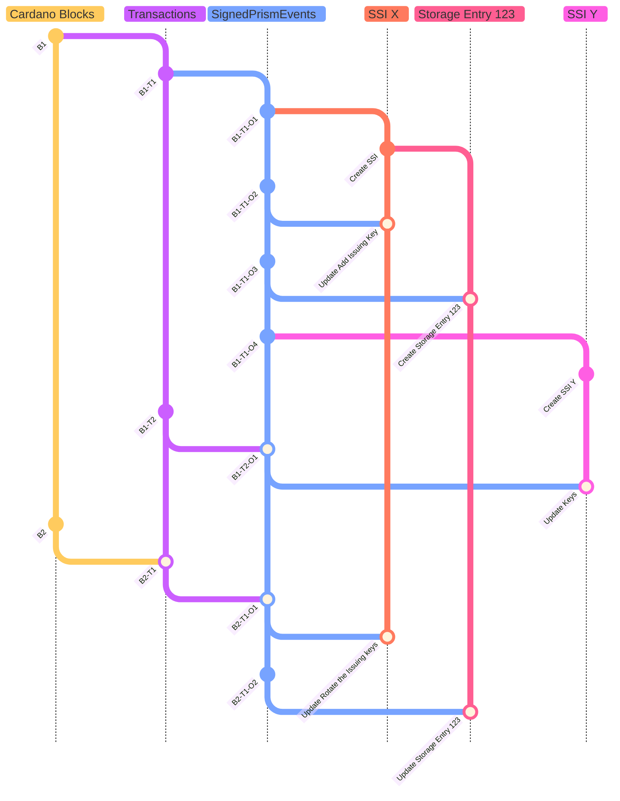
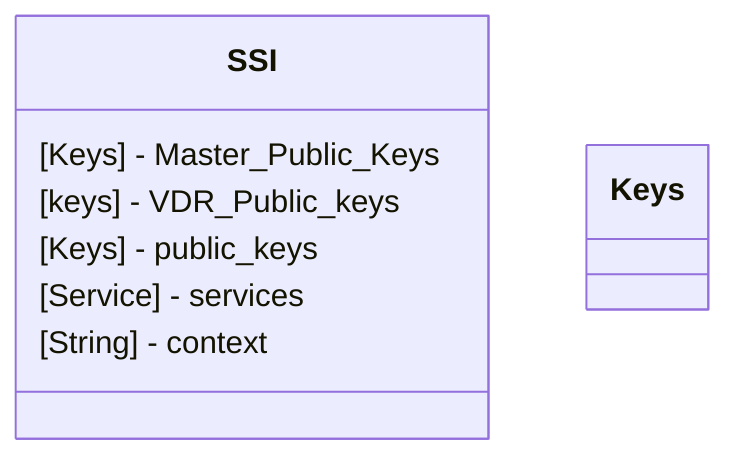
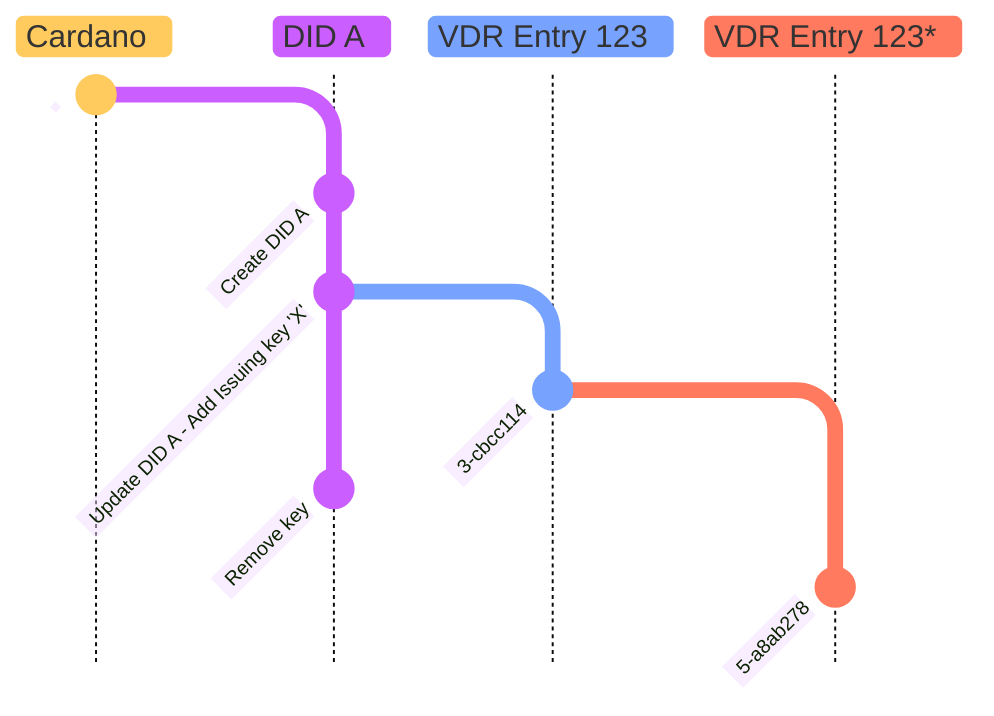

# Cardano PRISM VDR Specification

## Status of this document
 This document is a draft proposal for a Verifiable Data Registry (VDR). The document is in constant evolution, and future versions are under development. Implementers are encouraged to follow the evolution of the new versions closely to understand, provide feedback and suggest changes.

## Abstract

This document defines a protocol for a Verifiable Data Registry (VDR) that uses the Cardano blockchain as the source of truth.
It uses the blockchain transaction metadata to record verifiable information that can be updated by entities possessing the associated cryptographic keys.

The fundamental building block of this VDR is the creation of a Self-Sovereign Identity (SSI) on the Cardano blockchain.
This SSI-based model is as decentralized and distributed as the underlying Cardano ledger itself.

This VDR protocol specifies events/operations, serialization formats, and lifecycle management rules for the VDR entries.
A VDR node or VDR indexer refers to software implementing this specification.

This protocol has the same foundation already used by the [`did:prism` DID method](https://github.com/input-output-hk/prism-did-method-spec/blob/main/w3c-spec/PRISM-method.md), which follows the [DID Core Specification](https://www.w3.org/TR/did-core/) to define Decentralized Identifiers (DIDs) on top of this Cardano VDR.

We would like to remark that, any reference to the blockchain such as, "Cardano network", "underlying chain", "on-chain", "ledger", "the blockchain" and similar ones throughout this document refer to Cardano mainnet unless explicitly said otherwise.
The prism DID method, in its current form, solely depends on and uses Cardano mainnet.

## Protocol parameters

Parameter            | Value             | Description
-------------------- | ----------------- | -----------
NETWORK              | `mainnet`         | Cardano blockchain network
PRISM_LABEL          | `21325`           | Cardano metadata label used by this protocol
CRYPTOGRAPHIC_CURVE	 | `secp256k1`       | Cryptographic curve used with a key.
SIGNATURE_ALGORITHM	 | SHA256 with ECDSA | Asymmetric public key signature algorithm.
HASH_ALGORITHM       | SHA-256           | Algorithm for generating hashes.
SECP256K1_CURVE_NAME | `secp256k1`       | String identifier for the SECP256K1 elliptic curve
ED25519_CURVE_NAME	 | `Ed25519`         | String identifier for the ED25519 elliptic curve
X25519_CURVE_NAME	   | `X25519`          | String identifier for the Curve25519 elliptic curve

Notes: 
- `PRISM_LABEL` is used by:
  - `did:prism` method - [prism-did-method-spec](https://github.com/input-output-hk/prism-did-method-spec/).
  - PRISM CredentialBatch - Specification is not public.
  - Anything that anyone wants to, for whatever reason.
- The `CRYPTOGRAPHIC_CURVE` is the key type used by the master key.
  It follows the guidance of [CIP-0016 - Cryptographic Key Serialisation Formats](https://github.com/cardano-foundation/CIPs/tree/master/CIP-0016)

## Events/Operations

The PRISM VDR is composed of a sequence of **immutable** events/operations.
As the source of truth and order, the events/operations are permanently recorded in the Cardano (mainnet) blockchain transaction metadata.
Multiple events/operations can be record in a single blockchain transaction.
Events/Operations can either be independent or dependent. Forming a chain from previous events/operations.
Events/operations can be considered valid or invalid, according to the validation algorithm for each category of events.
Invalid events/operations are ignored. 
Valid events/operations can create reference or for a chain to update the state of a reference. (a `did:prism:...` or a storage entry are example of references).
The chain events is intentar to update the state of the reference but doesn't necessary needs to update the state be a valid event.

There are several categories of events/operations representing different entries in this VDR:
- `SSI` - Self-Sovereign Identity of [**did:prism**](https://github.com/input-output-hk/prism-did-method-spec/blob/main/w3c-spec/PRISM-method.md).
- IssueCredentialBatch - Legacy ATALA PRISM format (for credential revocation)
- `Storage` - Stores small amount of information (limited by Cardano metadata constraints), that represents mutable data.
- Future extensions — Any future extension MUST maintain **backward** and **forward** compatibility

Events may depend on others (e.g., a Storage Entry must be linked to an SSI entry).

All events/operations follow an order. The timeline which the event occurs in the blockchain.
- Events follow blockchain transaction order.
- Within a transaction, events follow the order they appear in PrismBlock.

### Encoding format

All data is encoded in protobuf to ensure backward and forward compatibility.

In this document we the **notation:** `E-x-y-z` to denote paths in the data model (E = root event, x/y/z = field indices).

### SSI entry

The fundamental data structure of the VDR are the `SSI` entries.
Any Self-sovereign identity (`SSI`) entry represents a `DID`.
It also contains additional information that is not part of the `DID` standard. Such as the `MASTER_KEY` and the `VDR_KEY`.

The conversion from an `SSI` entry to a `DID Document` as specified by [DID Core](https://www.w3.org/TR/did-1.0/), follows the [**did:prism**](https://github.com/input-output-hk/prism-did-method-spec/blob/main/w3c-spec/PRISM-method.md) specification.

`DID`s are typically anchored on an underlying system or network. Regardless of the specific technology, any system that can record `DID`s and provide the data required to construct corresponding `DID Document`s is called a Verifiable Data Registry (`VDR`) - https://www.w3.org/TR/did-core/#detailed-architecture-diagram.
In the case of the `did:prism` method, identifiers are recorded in the `PRISM VDR`, which is defined by the protocol described in this specification.
The `SSI` entries are only one of the categories of events types supported by this VDR.

#### SSI events type
There are three types of events/operations for `SSI` entries.

Event Name     | Protobuf | Description
-------------- | -------- |-------------
Create SSI     | `E-1`    | Create a new `SSI` (and `DID`) identifier.
Update SSI     | `E-2`    | Builds a chain of `SSI` events to update the state of the `SSI` identifier.
Deactivate SSI | `E-6`    | Deactivate `SSI` identifier. This is an end stat and can no longer be activated.



#### Validation rules:
- The `E-1` event MUST be signed with the private part of the `MASTER_KEY` it specifies.
- The identifier of the `SSI` MUST be the hash of the `E-1` event (using `HASH_ALGORITHM`) serves as the unique SSI reference.
- The `E-2` and `E-6` events MUST be signed by an `MASTER_KEY` listed in the `SSI` at that point in time.
- The `E-2-1` and `E-6-1` events MUST point to the `previous_event_hash`. The reference (hash) of the most recent event that was used to create or update the SSI.
- The `MASTER_KEY` MUST use the curve `SECP256K1_CURVE_NAME`.
-  Note:
   The `did:prism` also has a long form which the source of truth might not be on the blockchain."
   <br> The long form identifier is related with a canonical form identifier.
   <br> If the canonical identifier is not on the blockchain then the long form is self contained.
   <br> The `E-1` pure protobuf (without being warped in a signed event) is encoded from the binary representation of the protobuf into `base64URL` and then appended to the end of the canonical form, separated by the character `:`.
   <br> See [**did:prism** specification](https://github.com/input-output-hk/prism-did-method-spec/blob/main/w3c-spec/PRISM-method.md) for more information.


#### Algorithm generate DID Document from SSI

Note: Storage entry depends on the SSI.

For more documentation refer to [**prism:did specs**](https://github.com/input-output-hk/prism-did-method-spec/blob/main/w3c-spec/PRISM-method.md).

To summarize, a DID is valid only when its underlying SSI has been created `#E-1` and not deactivate `#E-6`.
The DID Document is a simplified representation of the SSI's latest status.
That does not contain the `MASTER_KEY`; `ISSUING_KEY`; `VDR_KEY`.

Note: There are use case where the SSI entry is not used as a DID. For example if you cares about managing Storage Entry.
The Prism Indexer MUST still be able to resolve that DID, even if the only field in the DID Document is the `id` of the DID it self.

So `{"id":"did:prism:00592a141a4c2bcb7a6aa691750511e2e9b048231820125e15ab70b12a210aae"}` its a valid DID Document.

### Storage entry

The Storage entries allow recording a small amount of information that represents mutable data.
The recorded information is persistent, public and is limited by Cardano metadata's constraints.

The Storage Entries form a chain like SSI entries (create → update ... → deactivate)

There are three types of events/operations over **Storage Entries** (see protobuf definition):
Event Name               | Protobuf | Description
------------------------ | -------- |-------------
Create Storage entry     | `E-7`    | Create a new storage entry. Where the identifier is the `HASH_ALGORITHM` of the protobuf.
Update Storage entry     | `E-8`    | Builds a chain on a storage entry to update the state of that entry.
Deactivate Storage entry | `E-9`    | Deactivate the storage entry. This is an end stat and can no longer be activated.

Note:
The amount of information stored in a Storage Entry should be relatively small.
The larger the amount of data, the more expensive it will be to submit as metadata in a transaction.
Additionally, transaction metadata has hard limits.

When a Storage Entry is created, the first field, `E-7-1`, refers to the identity `SSI` of the creator of the Storage Entry.
The Storage Entry is also designed as a chain, similar to the `SSI` entries. The creator (`E-7-1`) is allowed to send follow-up events/operations to update the content of the entry.

Like the `SSI`, the `**Storage Entry**` all events can be referenced by the hash (`HASH_ALGORITHM`). But the identifier of the entry is the reference of the first event of the chain.
The create storage event `E-7` should include a nonce (`E-7-50`) to allow for the creation of multiple distinct entries with the same initial information.
Example: For use cases like the **StatusList**, where the initial value may be identical (e.g., an array of zeros representing the validity of a credential), the nonce (`E-7-50`) ensures the creation of multiple distinct Storage Entries.

Also, like the `SSI`, it should be possible to resolve the Storage Entry to a point in time.
By default when resolving the Storage Entry it SHOULD return the latest state of the entry.



The Unknown State only exists on the PRISM Indexer implementation. 
It covers future extension of this protocol and represents either an Active or Deactivated state.

#### Validation rules
For the Storage Events (`E-7`, `E-8`, `E-9`) to be considered valid, they must meet the following criteria:
- the event must have a valid signature.
- All protobuf fields from `1...49` MUST be consider in the validation process in `E-7`, `E-8`, `E-9`.
  - At least one field must be present.
  - Any missing field from the port above is considered valid.
  - If `E-7-1` is present the event must be signed by the owner's key, using:
    - the state of the `SSI` the moment before the event. (all and only the events before the one that is being validated)
    - the `SIGNATURE_ALGORITHM`
    - the curve `SECP256K1_CURVE_NAME`
    - the purpose `#KeyUsage-8` (VDR_KEY)
  - In `E-8`, `E-9` fields `2`(`E-8-2`) and `3`(`E-9-2`) must be present and point the reference of the latest valid event for that identifier.
  - Field `E-7-3...49` are reserved for future extension of this protocol.
    <br> (Note a PRISM Indexer can still index and serve a requester all raw events about any storage entry without validating them or resolve the content of the data. See section below)
- the keys used must be present in the SSI at the time of the event. (Key rotation after the event does not invalidate the Storage Entries.)
- the `SSI` owner (`E-7-1`) must not be deactivated. Otherwise the **Storage Entries** SHOULD be considered deactivated.

**Notes about the protobuf structure:**
- For convenience, the three messages share a common subset of fields. This ensures that if the protobuf messages were merged, the field positions and their meanings would remain consistent.
- The fields from `1` to `49` of the protobuf message is used for validation.
  Although at the moment only field 1 is defined at the time of writing.
  - Field `1` its the owner of the entry - the specificId of the `did:prism`.
- The fields from `50` to `99` of the protobuf message is used for metadata.
  Although at the moment only field 50 is defined at the time of writing.
  - Field `50` its a nonce - can be used to generate different reference hash in the create event
    It allowed to make different entries with the same initial data possible.


The distinguish between metadata and validation fields is important for any VDR PRISM Indexer implementation.
If the validation fields is present MUST be considered for the validation on the event.
In the case the PRISM Indexer doesn't know the rules for the field it cannot consider the event valid or invalid.
Consequently, cannot resolve the content of the data if any of those skills are defined in a chain of events

**Future extensions to this document may introduce more ways encode data on the storage Entries.**
If the PRISM Indexer encounters an `UNKNOWN` encoded type of data in the protobuf fields of events `E-7` and `E-8`, it may ignore the content of that particular Storage entry.
However, the existence of the Storage entry must still be recognized, verified, indexed, and any related events should be returned by the PRISM Indexer. In cases of unsupported types, the resolved content can be left blank or empty.

Users of the indexer SHOULD always have the opportunity to get all the associated raw events. So they can locally verified and resolve the content.  

The encode method of the Storage Entry may be defined by the create event/operation, depending on the protobuf field used:
 the data, the following types of information/data may be stored:

Type of Data                    | Protobufs           | Represents
------------------------------- | ------------------- |-------------
 **bytes**                      | `E-7-100`,`E-8-100` | A raw array of bytes.
**CID (content identifier)**    | `E-7-101`,`E-8-101` | A reference to an IPFS document.
[WIP] **bitstring_status_list** | `E-7-???`,`E-8-???` | A status list, as defined by https://datatracker.ietf.org/doc/draft-ietf-oauth-status-list/10/
[WIP] **bitstring_status_list** | `E-7-???`,`E-8-???` | A status list, as defined by ???


##### Storage Entry - bytes (`E-7-100` & `E-8-100`)

This data type is designed to represent array of bytes.
To create the entry is simple.
The field `E-7-100` is the initial array of bytes (protobuf type `bytes`) that the content of this entry will have.
The field `E-8-100` is an array of bytes (protobuf type `bytes`) and will replace the previous content of the state with the new.

##### Storage Entry - IPFS CID (`E-7-101` & `E-8-101`)

This data type represented the **CID (content identifier)** of a document that should be on the **Interplanetary File System (IPFS)**. 

Note: 
This protocol (PRISM VDR) only stores a CID as the content.
They real content should be retrieved from an IPFS Gateway.

**Security considerations** - 
The **CID** is a reference to immutable data but also a hash of the data itself.
So it is recommended that when retrieving the data to verify this is the real data corresponding to that CID.

**Data Persistence considerations** -
Since **IPFS** relies on nodes voluntarily storing data, there is no guarantee that data will be stored permanently.
So for some use cases the actors may consider pining the data themselves in order to guarantee the Data Persistence.


##### [WIP] Storage Entry - Token Status List

This data type is designed to represents a status list, as defined by https://datatracker.ietf.org/doc/draft-ietf-oauth-status-list/10/

To create a Storage Entry of this type the `E-7` must have the field `E-7-??` defined.
The 


## Document History

0. Initial draft.
1. Fix typos and incorporate recommendations from reviews.

## Authors and Contributors

- **Fabio Pinheiro** <br>
  [Email: fabio.pinheiro@iohk.io](mailto:fabio.pinheiro@iohk.io) <br>
  [Github: FabioPinheiro](https://github.com/FabioPinheiro)

---

### Appendices

## Appendix A - Events/Operations


Events:









```
classDiagram
class KeyUsage
KeyUsage : #KeyUsage-0 UNKNOWN_KEY
KeyUsage : #KeyUsage-1 MASTER_KEY
KeyUsage : #KeyUsage-2 ISSUING_KEY
KeyUsage : #KeyUsage-3 KEY_AGREEMENT_KEY
KeyUsage : #KeyUsage-4 AUTHENTICATION_KEY
KeyUsage : #KeyUsage-5 REVOCATION_KEY
KeyUsage : #KeyUsage-6 CAPABILITY_INVOCATION_KEY
KeyUsage : #KeyUsage-7 CAPABILITY_DELEGATION_KEY
KeyUsage : #KeyUsage-8 VDR_KEY
```


### Interoperability
#### DID's service type "PrismVDR"
#### VDR Driver


## Appendices

### File 'prism.proto'

```proto
import "prism-credential-batch.proto";
import "prism-version.proto";
import "prism-ssi.proto";
import "prism-storage.proto";

/**
 * Wraps an PrismBlock and its metadata.
 */
message PrismObject {
  reserved 1, 2, 3; 
  reserved "block_hash";
  reserved "block_operation_count"; // Number of operations in the block.
  reserved "block_byte_length"; // Byte length of the block.
  
  PrismBlock block_content = 4; // The block content.
}

/**
 * Represent a block that holds events/operations.
 */
 message PrismBlock {
  reserved 1; // Represents the version of the block. Deprecated
  repeated SignedPrismOperation operations = 2; // A signed operation, necessary to post anything on the blockchain.
  }
  
// A signed operation, necessary to post anything on the blockchain.
message SignedPrismOperation {
  string signed_with = 1; // The key ID used to sign the operation, it must belong to the DID that signs the operation.
  bytes signature = 2; // The actual signature.
  PrismOperation operation = 3; // The operation that was signed.
}


// The possible events/operations affecting the blockchain.
message PrismOperation {
  // https://github.com/input-output-hk/atala-prism-sdk/blob/master/protosLib/src/main/proto/node_models.proto
  //  reserved 3, 4; // fields used by an extension of the protocol. Not relevant for the DID method
   // The actual operation.
  oneof operation {
    // Used to create a public DID.
    ProtoCreateDID create_did = 1;

    // Used to update an existing public DID.
    ProtoUpdateDID update_did = 2;

    // Used to issue a batch of credentials.
    ProtoIssueCredentialBatch issue_credential_batch = 3;

    // Used to revoke a credential batch.
    ProtoRevokeCredentials revoke_credentials = 4;

    // Used to announce new protocol update
    ProtoProtocolVersionUpdate protocol_version_update = 5;

    // Used to deactivate DID
    ProtoDeactivateDID deactivate_did = 6;

    // Used to create a public storage entry.
    ProtoCreateStorageEntry create_storage_entry = 7;

    // Used to update a storage entry.
    ProtoUpdateStorageEntry update_storage_entry = 8;

    // Used to deactivate a storage entry.
    ProtoDeactivateStorageEntry deactivate_storage_entry = 9;
  };
}
```

### File 'prism-version.proto'

```proto
// Specifies the protocol version update
message ProtoProtocolVersionUpdate {
  string proposer_did = 1; // The DID suffix that proposes the protocol update.
  ProtocolVersionInfo version = 2; // Information of the new version
}

message ProtocolVersion {
  // Represent the major version
  int32 major_version = 1;
  // Represent the minor version
  int32 minor_version = 2;
}

message ProtocolVersionInfo {
  reserved 2, 3;
  string version_name = 1; // (optional) name of the version
  int32 effective_since = 4; // Cardano block number that tells since which block the update is enforced

  // New major and minor version to be announced,
  // If major value changes, the node MUST stop issuing and reading events/operations, and upgrade before `effective_since` because the new protocol version.
  // If minor value changes, the node can opt to not update. All events _published_ by this node would be also
  // understood by other nodes with the same major version. However, there may be new events that this node won't _read_
  ProtocolVersion protocol_version = 5;
}
```

### File 'prism-ssi.proto'
```proto
// The operation to create a public DID.
message ProtoCreateDID {
  DIDCreationData did_data = 1; // DIDCreationData with public keys and services

  // The data necessary to create a DID.
  message DIDCreationData {
    reserved 1; // Removed DID id field which is empty on creation
    repeated PublicKey public_keys = 2; // The keys that belong to this DID Document.
    repeated Service services = 3; // The list of services that belong to this DID Document.
    repeated string context = 4; // The list of @context values to consider on JSON-LD representations
  }
}

// Specifies the necessary data to update a public DID.
message ProtoUpdateDID {
  bytes previous_operation_hash = 1; // The hash of the most recent operation that was used to create or update the DID.
  string id = 2; // @exclude TODO: To be redefined after we start using this operation.
  repeated UpdateDIDAction actions = 3; // The actual updates to perform on the DID.
}

message ProtoDeactivateDID {
  bytes previous_operation_hash = 1; // The hash of the most recent operation that was used to create or update the DID.
  string id = 2; // DID Suffix of the DID to be deactivated
}

// ##########

/**
 * Represents a public key with metadata, necessary for a DID document.
 */
message PublicKey {
  reserved 3, 4, 5, 6;
  string id = 1; // The key identifier within the DID Document.
  KeyUsage usage = 2; // The key's purpose.

  // The key's representation.
  oneof key_data {
    ECKeyData ec_key_data = 8; // The Elliptic Curve (EC) key.
    CompressedECKeyData compressed_ec_key_data =  9; // Compressed Elliptic Curve (EC) key.
  };
}

// Every key has a single purpose:
enum KeyUsage {
  // UNKNOWN_KEY is an invalid value - Protobuf uses 0 if no value is provided and we want the user to explicitly choose the usage.
  UNKNOWN_KEY = 0;
  MASTER_KEY = 1;
  ISSUING_KEY = 2;
  KEY_AGREEMENT_KEY = 3;
  AUTHENTICATION_KEY = 4;
  REVOCATION_KEY = 5;
  CAPABILITY_INVOCATION_KEY = 6;
  CAPABILITY_DELEGATION_KEY = 7;


  // !!!!!!!!!!!!!!!!!!!!!!
  VDR_KEY = 8; // Create, Update, Remove - VDR entries. This key does not appear in the document.
}

/**
 * Holds the necessary data to recover an Elliptic Curve (EC)'s public key.
 */
 message ECKeyData {
  string curve = 1; // The curve name, like secp256k1.
  bytes x = 2; // The x coordinate, represented as bytes.
  bytes y = 3; // The y coordinate, represented as bytes.
}

/**
 * Holds the compressed representation of data needed to recover Elliptic Curve (EC)'s public key.
 */
message CompressedECKeyData {
  string curve = 1; // The curve name, like secp256k1.
  bytes data = 2; // compressed Elliptic Curve (EC) public key data.
}

// ##########

message Service {
  string id = 1;
  string type = 2;
  string service_endpoint = 3;
}

// ##########

// The potential details that can be updated in a DID.
message UpdateDIDAction {

  // The action to perform.
  oneof action {
    AddKeyAction add_key = 1; // Used to add a new key to the DID.
    RemoveKeyAction remove_key = 2; // Used to remove a key from the DID.
    AddServiceAction add_service = 3; // Used to add a new service to a DID,
    RemoveServiceAction remove_service = 4; // Used to remove an existing service from a DID,
    UpdateServiceAction update_service = 5; // Used to Update a list of service endpoints of a given service on a given DID.
    PatchContextAction patch_context = 6; // Used to Update a list of `@context` strings used during resolution for a given DID.
  }
}


// The necessary data to add a key to a DID.
message AddKeyAction {
  PublicKey key = 1; // The key to include.
}

// The necessary data to remove a key from a DID.
message RemoveKeyAction {
  string keyId = 1; // the key id to remove
}

message AddServiceAction {
  Service service = 1;
}

message RemoveServiceAction {
  string serviceId = 1;
}

message UpdateServiceAction {
  string serviceId = 1; // scoped to the did, unique per did
  string type = 2; // new type if provided
  string service_endpoints = 3;
}

message PatchContextAction {
  repeated string context = 1; // The list of strings to use by resolvers during resolution when producing a JSON-LD output
}
```

### File 'prism-storage.proto'

```proto

/* Notes:
 *
 * A Storage Event can be one of the three types:
 *  - ProtoCreateStorageEntry
 *  - ProtoUpdateStorageEntry
 *  - ProtoDeactivateStorageEntry
 * Those three types/structures are independent. But at the same time (just for implementation convenience),
 *   they shared the a common structure / field positions.
 *
 * The fields from position 1 and 2 are reserved are used in the validation process of the Storage Events (now).
 * The fields from position 3 to 49 are reserved to be used in the validation process of the Storage Events (in the future).
 *   If one of those fields/position are present (in a valid event) the Indexer MUST consider the Storage Entry and unsupported (no valid) from that moment, forward.
 * The fields from position 50 to 99 are for adding relevant metadata that does not impact the validation process of the Storage Events.
 */

/** StorageEventCreateEntry
 * To be valid, this operation needs to be signed by an issuing key of the DID:
 * - 1) The issuing key need to be valid at the Event/Operation moment
 * - 2) The DID needs not to be Deactivate
 */
message ProtoCreateStorageEntry {
  reserved 2; // Only used by ProtoUpdateStorageEntry & ProtoDeactivateStorageEntry
  reserved 3 to 49; // Those field will be used for validation the Storage Events in the future
  bytes did_prism_hash = 1; // The specificId of the did:prism.
  bytes nonce = 50; // Used to generate different reference hash (to make different entries with the same initial data possible)
  oneof data {
    // Nothing // The data field can be missing representing ANY type
    bytes bytes = 100;
    string ipfs = 101; // CID
    // string ipns = ??; // https://docs.ipfs.tech/concepts/ipns/
    StatusListEntry statusListEntry = 102;
  }
}

/** StorageEventUpdateEntry
 * To be valid, this event needs to be signed by an issuing key of the DID:
 * - 1) The issuing key need to be valid at the Event/Operation moment
 * - 2) The DID needs not to be Deactivate
 */
message ProtoUpdateStorageEntry {
  reserved 1, 50; // Only used by ProtoCreateStorageEntry
  reserved 3 to 49; // Those field will be used for validation the Storage Events in the future
  bytes previous_event_hash = 2; // The hash of the most recent event that was used to create or update the VDR Entry.
  oneof data { // The data field can be missing
    // Nothing // The data field can be missing representing ANY type
    bytes bytes = 100; // Replace the bytes
    string ipfs = 101; // Update/replace the data with a CID to IPFS. This is static data
    StatusListEntry statusListEntry = 102; // compliments the previous state with just the change (similar to a diff)
  }
}

message ProtoDeactivateStorageEntry{
  reserved 1, 50; // Only used by ProtoCreateStorageEntry
  reserved 3 to 49; // Those field will be used for validation the Storage Events in the future
  bytes previous_event_hash = 2; // The hash of the most recent event that was used to create or update the VDR Entry.
}

// ******************
// *** DATA TYPES ***
// ******************

/** TODO WIP Status List entry
 *
 * This is to be inspired on the following specs (Token Status List & BitstringStatusList):
 * - Token Status List:
 *   - https://datatracker.ietf.org/doc/draft-ietf-oauth-sd-jwt-vc/:
 *   - https://datatracker.ietf.org/doc/draft-ietf-oauth-status-list/06/
 * - BitstringStatusList:
 *   - https://www.w3.org/TR/vc-bitstring-status-list/#bitstringstatuslist
 *   - https://datatracker.ietf.org/doc/draft-ietf-oauth-status-list/10/
 */
message StatusListEntry {
  int64 state = 1;
  string name = 2; // optional
  string details = 3; // optional

  // uint32 listSize = 1;
  // uint32 statusSize = 2;
  // bytes intStatus = 3;
}
```

### File 'prism-credential-batch'

```proto
// Represents a credential's batch.
// Specifies the data to issue a credential batch.
message ProtoIssueCredentialBatch {
  CredentialBatchData credential_batch_data = 1; // The actual credential batch data.
}
// Check the protocol docs to understand it.
message CredentialBatchData {
  string issuer_did = 1; // The DID suffix that issues the credential's batch.
  bytes merkle_root = 2; // The Merkle root for the credential's batch.
}
  
  
// Specifies the credentials to revoke (the whole batch, or just a subset of it).
message ProtoRevokeCredentials {
  bytes previous_event_hash = 1; // The hash of the event that issued the batch.
  string credential_batch_id = 2; // The corresponding batch ID, as returned in IssueCredentialBatchResponse.
  repeated bytes credentials_to_revoke = 3; // The hashes of the credentials to revoke. If empty, the full batch is revoked.
}
```


## Notes

We are increasing the capabilities of the PRISM VDR!
PRISM VDR is a generalization of the PRISM DID!

This VDR follows the notion of Cardano time.
The Cardano blockchain was chain of blocks of transactions. Each blocks was multiple transactions. Each transaction can have metadata with a PRISM Block. Each PRISM block can have a Sequence of Sign Events.
So all PRISM events was an order between them.

https://github.com/input-output-hk/prism-did-method-spec/issues/46

- Tackled the question about Historical information in `did:prism` method - https://github.com/input-output-hk/prism-did-method-spec/issues/43


## Indexer

Design goals:
- The Indexer MUST be deterministic.
- The Indexer MUST be able to revert all steps to a previous `Cardano Block`.
  Ideally, we recommend that the index is able to backtrack all the steps and unapply. 
- It's not responsibility of the Indexer to validate the signature of the PRISM Event.
- The Indexer is discribed for the general use case.


### Storage entries

Each entry is by definition unique `Protobuf data of the PRISM Event` + `Event Order index (age of the event)`
All correctly formatted 'PrismObject' Protocol

### Storage entries

Each entry is by definition unique `Protobuf data of the PRISM Event` + `Event Order index (age of the event)`
All correctly formatted 'PrismObject' Protocol

### Event Order Index (unique index entries)
  
The goal is to index all the blockchain metadata (with PRISM_LABEL) and with a PrismObject

Index: **`'block_height' - Cardano Block index` + `Transaction index` + `PRISM Event index`** into a Hash of the PRISM Event

### PRISM Event Hash Index (index over the storage entries but is not unique)

The goal is to have all PRISM Event

Index: the Hash of the PRISM Event into the entry.

The index is not unique because anyone can submit multiple times (but will have `Event Order index`).
Although we only care about the oldest event in the blockchain.

###  Self-sovereign identity (SSI) index

The goal of this index all he Self-sovereign identity.
In [prism:did](https://github.com/input-output-hk/prism-did-method-spec/blob/main/w3c-spec/PRISM-method.md) this in the DID's specificId

### Storage

Another objects in the PRISM VDR are Storage Entry.
The Storage entries are used to store information. All the information will be publicly available in the blockchain.
The Storage Entry is also designed to be a chain. So data can be modified by the owner.
The amount of information/data on the Storage Entry is SHOULD be relatively small. Also the bigger the amount og information the more expensive will be to submit as metadata in a transaction. This transaction metadata also have hard limits.

There are different types of information, from Raw Byte to specific cases.

The creation of a Storage Entry is associated one SSI entry (the owner).
Any  must be .
For the Storage Events (CreateStorage/UpdateStorage) to be valid it must:
- have a valid signature.
- be signed by owner's key
  - using the $SIGNATURE_ALGORITHM
  - with the curve $SECP256K1_CURVE_NAME
  - with the purpose KeyUsage 8 (VDR_KEY)
- have the keys presented on the SSI, at the time of the Event. (So rotating the key after does not invalidated the Storage entries.)
- the SSI (owner) must not be deactivated.


#### Storage Create Event

This Event event create a Storage Entry.
The storage owner by the `ssi_ref (1)`
The hash of this Event will be used as the reference/id of this entry.

```proto
message StorageEventCreateEntry {
  bytes ssi_ref = 1; // Same as the specificId of the did:prism.
  oneof data {
    bytes bytes = 2;
  }
}
```

#### Storage Update Event

The Update event modify/update the Storage Entries.

```proto
message StorageEventUpdateEntry {
  bytes previous_event_hash = 1; // The hash of the most recent event that was used to create or update the Storage Entry.
  oneof data {
    bytes bytes = 2
  }
}
```

### Illustration of timeline chain Block/Transactions/Events/SSI/StorageEntry

The image below illustrates how chains are form in Cardano blocks, transactions, VDR events, SSI Entries and Storage Entries.
<br> It also illustrates the relationship between chains and how everything is ordered in a timeline.




---
---
---
---
---
---
---
---
---
---
---
---
---
---
---
---
---
---
---
---
---
---
---
---

# ********* REMOVE *********


## Algorithms

### Algorithm SSI object from the sequence of events.

Any Self-Sovereign Identity in this VDR is a sequence of Events/Operations that form a chain.
The frist element of the chain MUST contain the `E-1` create identity event.
The HASH of the `SignedPrismEvent` with the `E-1` is the reference of the SSI.
The signature in `SignedPrismEvent` is self sign. Signed by one of the MASTER_KEY type `KeyUsage-1` contained in the create event `E-1`.

Lets consider the following class. This is just an example to ilustrate the transformation of the set of events chain into an object that represent all the information of the SSI.




The fileds `public_keys`; `services`; `context` are a direnct copy of the create event `E-1`
Note the public Master keys and public VDR keys MUST be of the keys of the type `SECP256K1_CURVE_NAME`. Those keys will be used by the PRISM Node, PRISM Indexer and others libs to validate the chains of each SSI.
If another curve is used on those keys, the keys Should be ignored.

On saction ???? with will describe how to converted from this SSI struture into the DID Document. 

This SSI struture can be update with update events `#E-2` or deactivate with `#E-6`


### Algorithm Storage object from the sequence of events.

Note: Storage object depends on the SSI object. To validade the Storage entries its neesasary to resolve the SSI at the exact point in time. 

For this algorithm lets consided as a valid keys to sign the Prism Events/Operations all key in the ower's SSI with the `#KeyUsage-8` (VDR_KEY) and with the curve `SECP256K1_CURVE_NAME` on the moment that the events occurs. 


#### Storege data type Bytes

The create event its a simple array of bytes. Field  `bytes (2)` it includes the initial data.
The update event its will replate the bytes with the new set of bytes in `bytes (2)`.
 

#### Storege data type BitstringStatusList
https://www.w3.org/TR/vc-bitstring-status-list/#bitstringstatuslist

#### Storege data type StatusList
// Token Status List https://datatracker.ietf.org/doc/draft-ietf-oauth-sd-jwt-vc/:
// https://datatracker.ietf.org/doc/draft-ietf-oauth-status-list/06/


#### What this Storage is not good for

Store Schemas in VDR is a bad usecase.
A Schema is more like an Ontology.
Schemas should be immutable.
Schemas should not have ower.
IPFS is a better place to store Schemas

## Future work

CIP-0008 -> https://github.com/cardano-foundation/CIPs/tree/master/CIP-0008

## TODO


https://docs.blockfrost.io/#tag/cardano--metadata
curl -H 'project_id: $BLOCKFROST_PROJECT_ID' "https://cardano-mainnet.blockfrost.io/api/v0/metadata/txs/labels/21325?count=1&page=100&order=asc" | jq
curl -H "project_id: $BLOCKFROST_PROJECT_ID" "https://cardano-mainnet.blockfrost.io/api/v0/blocks/eb625cdac8f97791b2fc7d86057b26179e2c08f772411e43809afc6d997f900a/txs"
curl -H "project_id: $BLOCKFROST_PROJECT_ID" "https://cardano-mainnet.blockfrost.io/api/v0/txs/17dfa3cb53c3c64b015241c120b3081a6e32e96829274fee70bb312f36373f02/metadata" |jq

  val Mainnet = "https://cardano-mainnet.blockfrost.io/api/v0"
  val Preprod = "https://cardano-preprod.blockfrost.io/api/v0"
  val Preview = "https://cardano-preview.blockfrost.io/api/v0"
  val Testnet = "https://cardano-testnet.blockfrost.io/api/v0"

curl -H 'project_id: $BLOCKFROST_PROJECT_ID' "https://cardano-mainnet.blockfrost.io/api/v0/metadata/txs/labels?count=1&page=2013&order=asc" | jq
[
  {
    "label": "21325",
    "cip10": null,
    "count": "6453"
  }
]




checkout DID_A


  
Notes:

1- We need to be able to resolve any PRISM DID at the specific point on time
2- All PRISM operations needs to be ordered!
If the key that created, the VDR is rotated or removed the VR is still valid?!
All VDR is related to a DID? This might not be good

